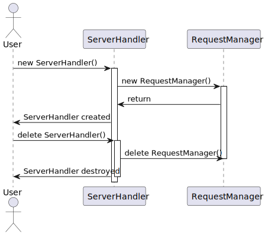
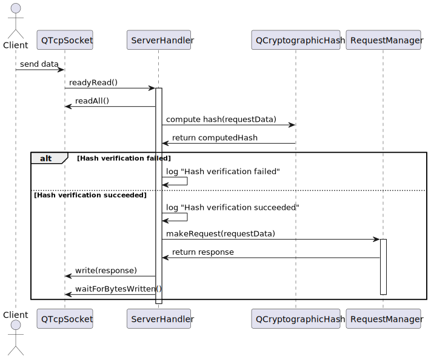
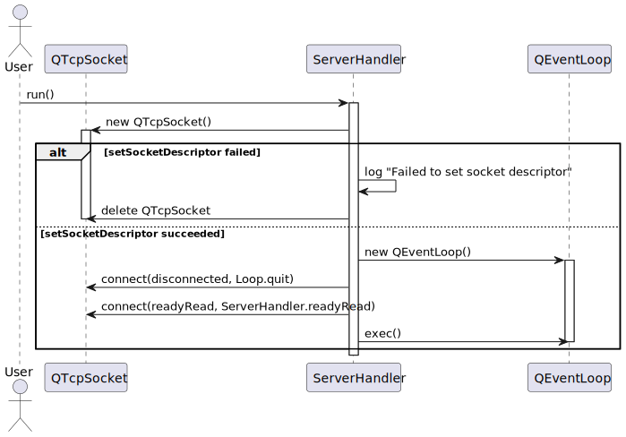
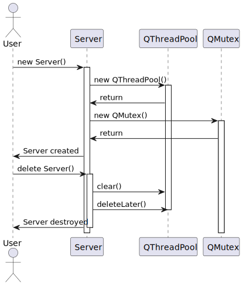
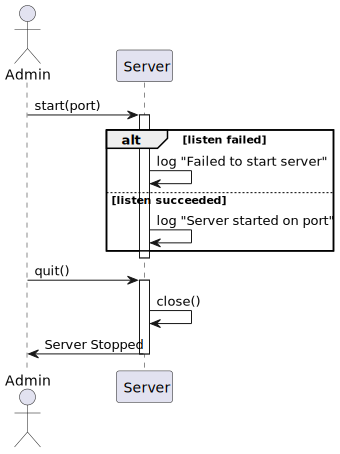
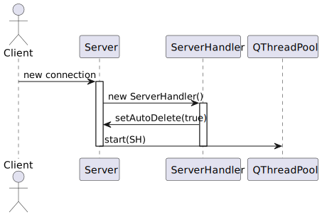
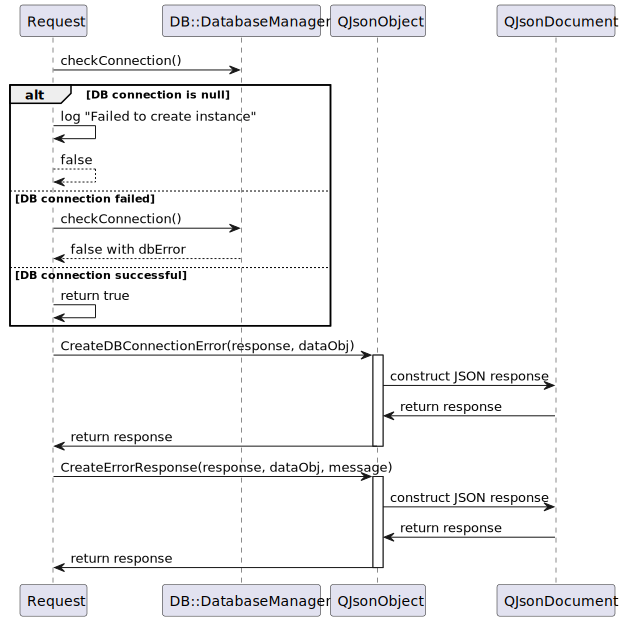

# Modules Sequence Diagrams

## ServerHandler Diagrams:
### Sequence diagram : ServerHandler initialization and destruction

### Sequence diagram : `ServerHandler` processes `readyRead` event

### Sequence diagram : `ServerHandler` runs the `run` method

## RequestManager Diagrams:
### Sequence diagram : `RequestManager` processes requests

## Server Diagrams:
### Sequence diagram : Initialization and destruction of `Server`

### Sequence diagram : `Server` starts and stops

### Sequence diagram : `Server` processes `incomingConnection`

## Request Diagrams:
### Sequence diagram : `Request` processes a request

### Sequence diagram : `Request` base class handles database connection and error response

## DatabaseManager Diagrams:
### Sequence diagram : `DatabaseManager` initialization and connection check

## Sequence diagram : `DatabaseManager` processes queries (Example: select query) and returns results

