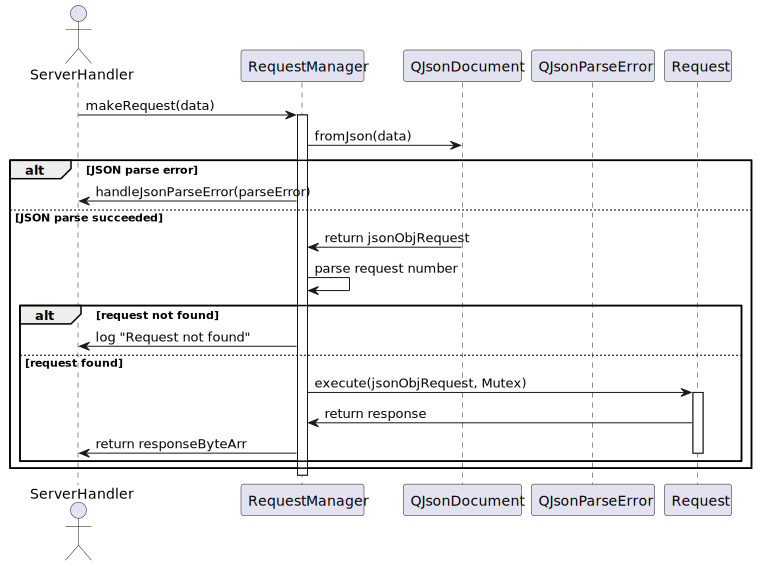

# QT-Banking-System-Server

## Overview

QT-Banking-System-Server is the server-side implementation of a banking system, developed using the Qt 6/C++ framework. The server handles client requests, performs database operations using PostgreSQL with Supabase hosting, and ensures secure and efficient communication between clients and the database.

The server application is designed to be multi-threaded, enabling concurrent handling of multiple clients and requests. It includes features such as request handling, database operations, logging, and secure communication to provide a robust and reliable banking system.

<!-- link for Client-Server project -->
> [!NOTE]
> This project is part of a Banking System (TCP Client-Server) project, which includes the following repositories:
> - [QT-Banking-System-Client](https://github.com/7osssam/QT-Banking-System-Client): The client-side implementation of the banking system.
> - [QT-Banking-System-Server](https://github.com/7osssam/QT-Banking-System-Server): The server-side implementation of the banking system.


## Features

- **Request Handling:** Manages various client requests such as user management, transaction processing, and data retrieval.
- **Database Operations:** Performs CRUD operations on user accounts and transaction records.
	- By using the [Database Module](src/dbModule), the server can connect to the database, execute queries, and handle results in a multi-threaded environment using Qt's `QThreadStorage` for thread-local storage.
- **Logging:** Logs server activities and client requests for monitoring and debugging purposes in a multi-threaded fashion.
	- For more details, see the [LogByThread](https://github.com/7osssam/LogByThread) library used in the project.
- **Secure Communication:** Implements security measures to ensure secure communication with clients and database.
	- For example, hashing and encryption techniques are used to protect sensitive data.
- **Concurrency server:** The server can handle multiple clients concurrently using Qt's `QTcpServer` and `QTcpSocket` classes.
	- The server can process multiple requests simultaneously using a thread pool.


## Technologies Used

- **C++/Qt 6:** Core language and framework for building the server application.
  - **Qt Components:** Core, Network and Sql modules.
- **PostgreSQL with Supabase:** Database management system for handling data operations.
- **JSON:** Data format for communication between client and server.
- **CMake:** Build system for managing the build process.
- **GoogleTest:** Framework for unit testing the application.
- **GitHub Actions:** Continuous integration for automated testing and documentation generation.
- **Doxygen:** Tool for generating documentation from source code.


## Setup and Installation

### Prerequisites

- Qt 6.7.1 or later
- CMake
- MinGW or another compatible compiler
- PostgreSQL database
- Supabase account and configuration

### Building the Project

1. Clone the repository:
```sh
git clone https://github.com/7osssam/QT-Banking-System-Server.git
cd QT-Banking-System-Server
```

2. Install dependencies:
```sh
make dependency
```

3. Configure the project using CMake:
```sh
make clean-cache-reconfigure
```

4. Build the project:
```sh
make build
```

### Running the Server

To run the server application, execute the following command:
```sh
make run
```

## Request Handling

The server handles various requests through the `RequestManager` and specific request classes located in the `requestModule/Requests` directory. Each request class inherits from the base `Request` class and implements the necessary logic for processing the request, including validation, database operations, and response generation.

for more details, see the [Requests Documentation](Requests-Documentation.md).

- This sequence diagram illustrates the process of handling a client request by the server:

> More detailed diagrams for each module can be found in the [Modules Sequence Diagrams](Modules-Sequence-Diagrams.md) or `docs/diagrams/` directory.

## Database Operations

Database operations are managed through the `dbModule` (or `DB` namespace), which includes classes for connecting to the database, executing queries, and handling results in a multi-threaded environment using Qt's `QThreadStorage` for thread-local storage. This module is built as a separate library to ensure modularity and reusability across the server application.

- This sequence diagram illustrates the process of the initialization of the database connection:
<!-- docs\diagrams\plantuml\sequence-diagrams\Modules\DatabaseManager_init.svg -->


- This sequence diagram illustrates the process of executing a query and handling the result:
<!-- docs\diagrams\plantuml\sequence-diagrams\Modules\DatabaseManager_query.svg -->

> More detailed diagrams for each module can be found in the [Modules Sequence Diagrams](Modules-Sequence-Diagrams.md) or `docs/diagrams/` directory.


## Testing

Unit tests are written using GoogleTest. To build and run the tests, execute the following command:
```sh
make test
```

## Documentation

Comprehensive documentation is available, detailing the purpose, design, and usage of each class and function within the project. The documentation is generated using Doxygen and can be viewed by opening the `docs/html/index.html` file in a web browser or by visiting the [GitHub Page](https://7osssam.github.io/QT-Banking-System-Server/) site.

## Continuous Integration

The project uses GitHub Actions for continuous integration. The build and test status can be monitored through the following badges:

| Documentation | Pages Build Deployment | Ubuntu CI Test |
|---------------|------------------------|----------------|
| [](https://github.com/7osssam/QT-Banking-System-Server/actions/workflows/documentation.yml) | [](https://github.com/7osssam/QT-Banking-System-Server/actions/workflows/pages/pages-build-deployment) | [](https://github.com/7osssam/QT-Banking-System-Server/actions/workflows/Ubuntu.yml) |

## Contribution

Contributions are welcome! Please open an issue or submit a pull request for any changes or enhancements.

## License

This project is licensed under the MIT License. See the LICENSE file for details.

---

Happy coding!