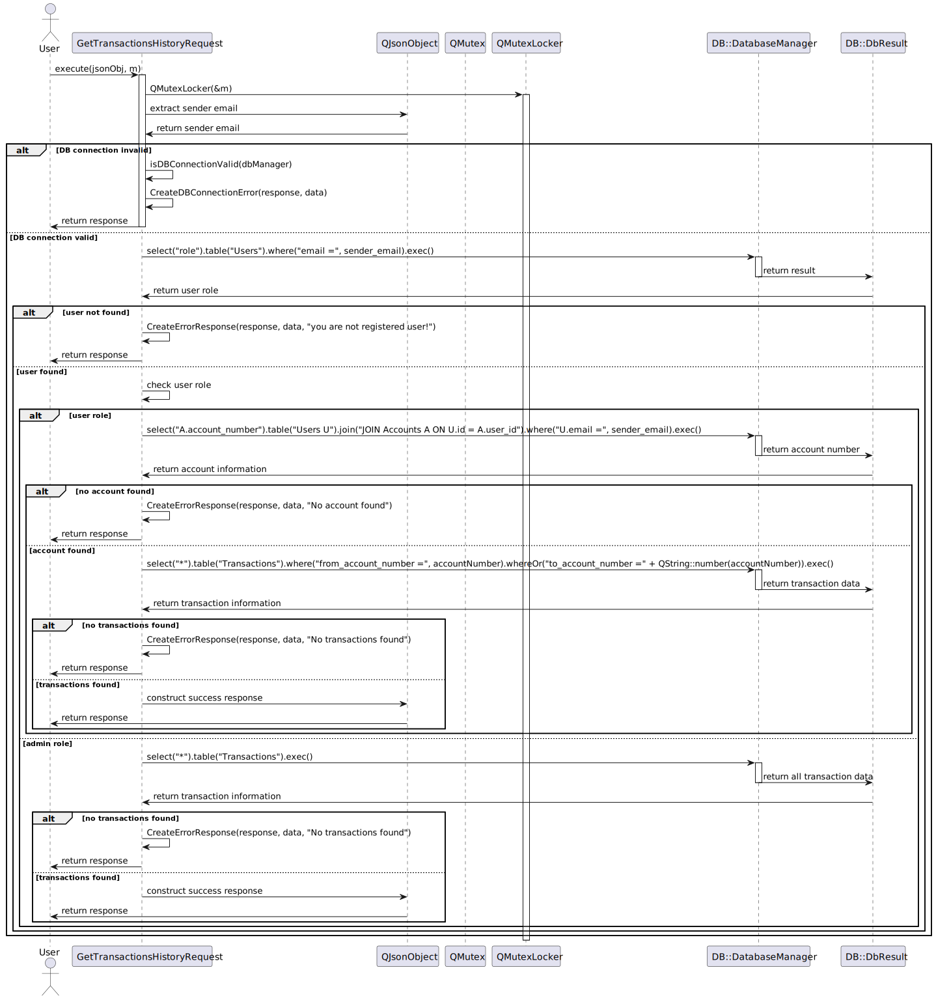
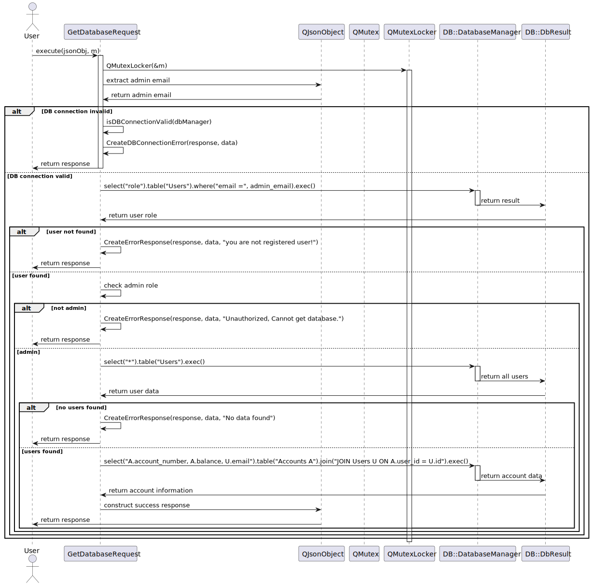
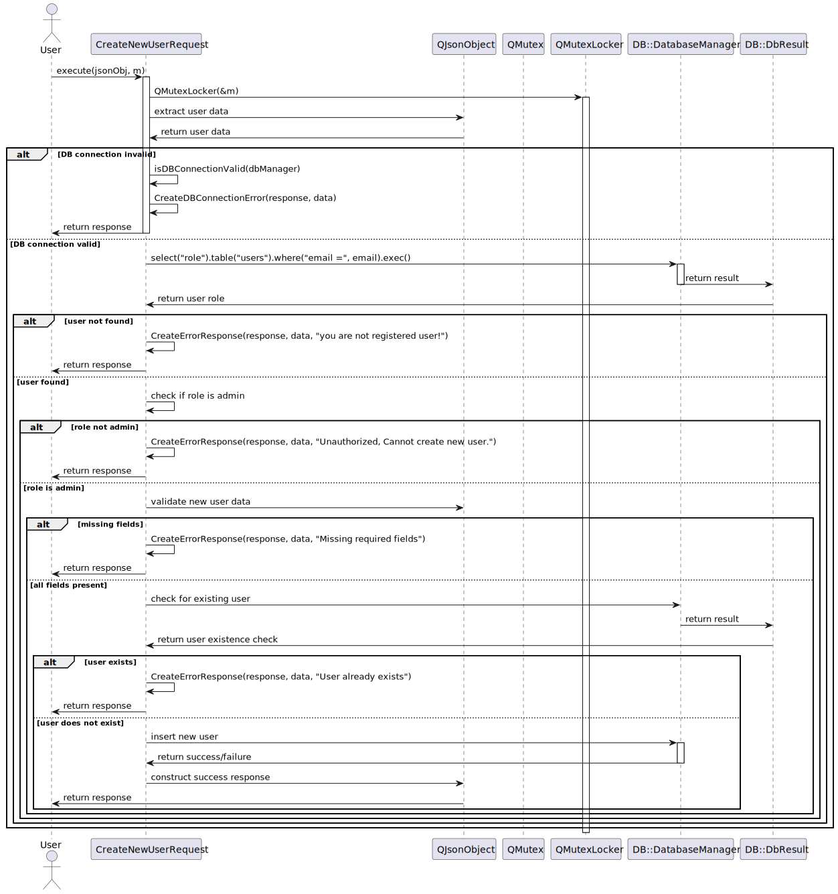
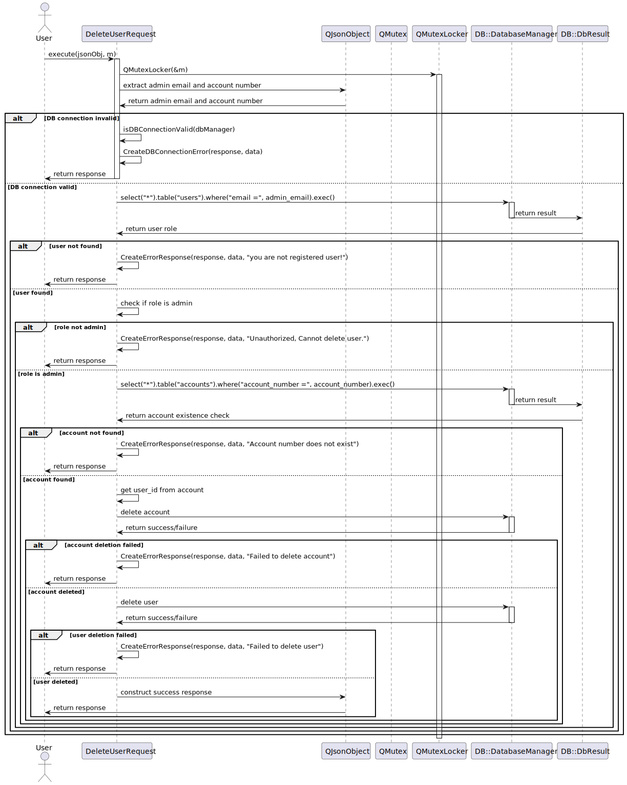
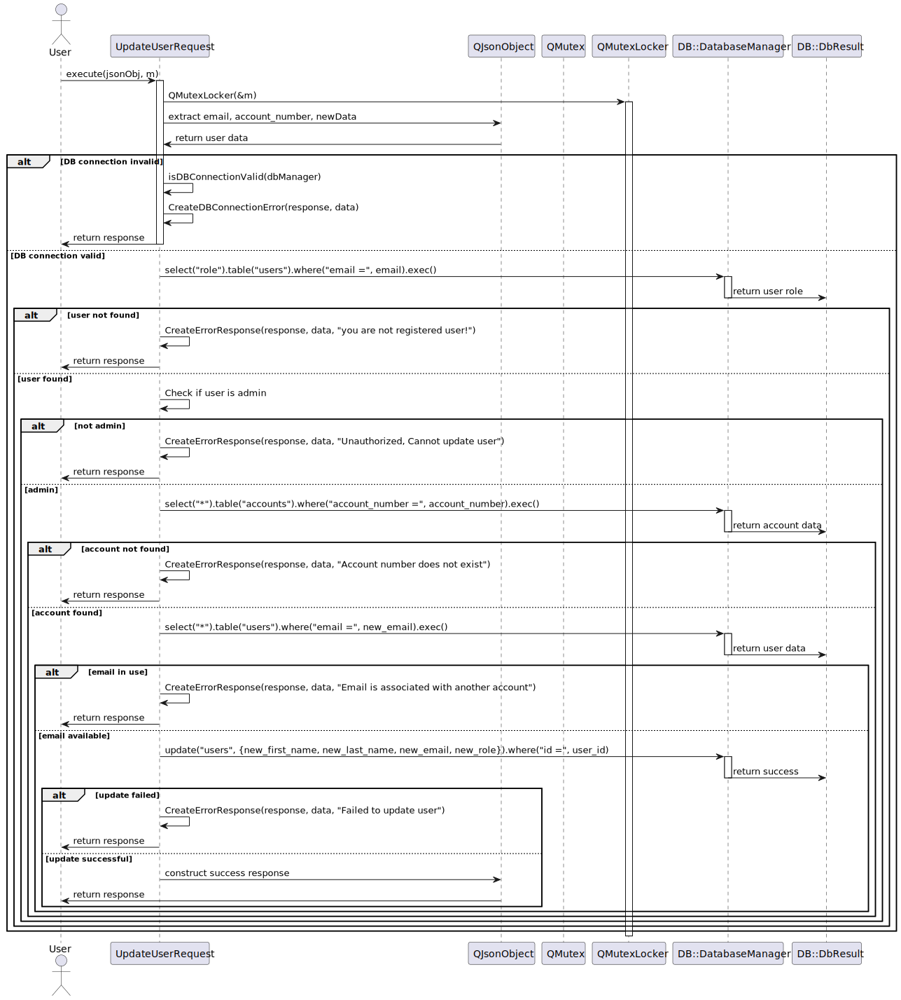
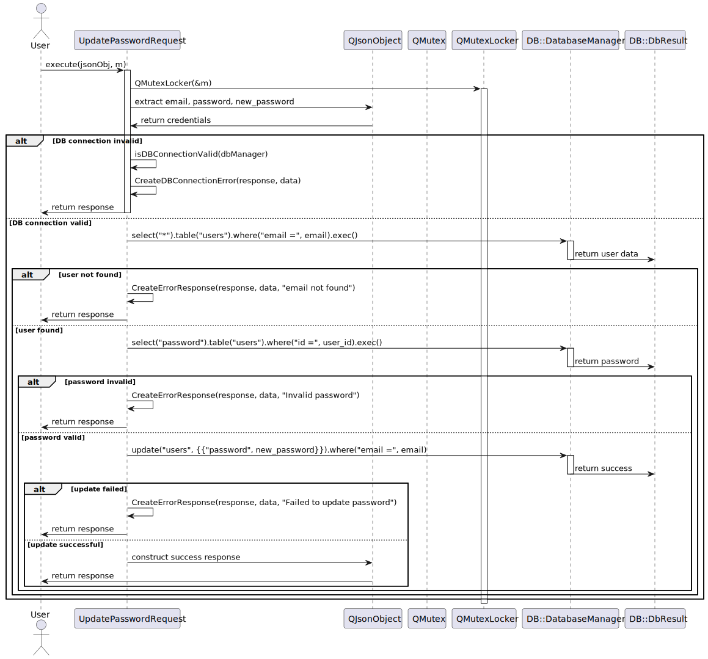

# Requests Documentation
This document describes the requests that can be sent to the server and the responses that can be received from the server.

## 1. Login Request

### Send Request:

```json
{
    "Request": 1,
    "Data":
        {
        "email": "user@example.com",
        "password": "pass"
        }
}
```

### Receive Response:

#### On Success:

```json
{
    "Response": 1,
    "Data": {
        "status": 1,
        "first_name": "User",
        "role": "user",
        "message": "Login successful"
    }
}
```

#### On Failure:

```json
{
    "Response": 1,
    "Data": {
        "status": 0
        "message": "email not found"
    }
}
```

 Or

```json
{
    "Response": 1,
    "Data": {
        "status": 0
        "message": "Invalid password"
    }
}
```

### Sequence diagram : `LoginRequest` processes login request


## 2. Get Account Number (for Logged-in user)

### Send Request:

```json
{
    "Request": 2,
    "Data": {
        "email": "user@mail.com"
    }
}
```

### Receive Response:

#### On Success:

```json
{
    "Response": 2,
    "Data": {
		 "status": 1,
        "account_number": 123456789
    }
}
```

#### On Failure:

```json
{
    "Response": 2,
    "Data": {
		 "status": 0,
        "message": "No account found"
        }
}
```

or
```json
{
    "Response": 2,
    "Data": {
		 "status": 0,
        "message": "email not found"
        }
}
```


## 3. Get Balance

### Send Request:

```json
{
    "Request": 3,
    "Data": {
        "account_number": 123456789
    }
}
```

### Receive Response:

#### On Success:

```json
{
    "Response": 3,
    "Data": {
	    "status": 1,
		"message": "Balance fetched successfully",
        "balance": 500.0     
    }
}
```

#### On Failure: (will not Usually happen)

```json
{
    "Response": 3,
    "Data": {
		 "status": 0,
        "message": "Account not found"
    }
}
```

### Sequence diagram : `GetBalanceRequest` processes get balance request


## 4. Get Transactions History

### Send Request:

### As User:
```json
{
    "Request": 4,
    "Data": {
		"email": "email@test.com"
    }
}
```

### As Admin:
```json
{
    "Request": 4,
    "Data": {
		"email": "admin@test.com"
    }
}
```

### Receive Response:

### As User:

```json
{
    "Request": 4,
    "Data": {
		 "status": 1,
		"message": "Transaction history retrieved for account number 123456789",
        "List":
            [  // User will get transactions to or from his account only
                {
					"from_account_number": 123456789,
                    "to_account_number": 987654321,
                    "transaction_amount": 100.0,
                    "created_at": "2021-01-01"
                },
                {
					"from_account_number": 987654321,
                    "to_account_number": 123456789,
                    "transaction_amount": 130.0,
                    "created_at": "2021-01-03"
                }
            ]
        }
 }
```

### As Admin:

```json
{
    "Request": 4,
    "Data": {
		 "status": 1,
		"message": "Transaction history retrieved for all users",
         "List":
            [  // Admin will get all transactions in the database
                {
					"from_account_number": 123456789,
                    "to_account_number": 987654321,
                    "transaction_amount": 100.0,
                    "created_at": "2021-01-01"
                },
                {
					"from_account_number": 987654321,
                    "to_account_number": 123456789,
                    "transaction_amount": 130.0,
                    "created_at": "2021-01-03"
                },
                {
					"from_account_number": 4343656567,
                    "to_account_number": 123232324,
                    "transaction_amount": 1435.0,
                    "created_at": "2021-01-03"
                }
            ]
        }
 }

```

### Sequence diagram : `GetTransactionsHistoryRequest` processes get transactions history request


## 5. Make Transaction

### Send Request:

#### Using email:
```json
{
    "Request": 5,
    "Data": {
		"from_account_number": 123456789,
        "to_account_number": -1,
		"to_email": "user@mail.com",
        "transaction_amount": 100.0
    }
}

```
#### Using account number:

```json
{
    "Request": 5,
    "Data": {
		"from_account_number": 123456789,
        "to_account_number": 1222255555,
		"to_email": "",
        "transaction_amount": 100.0
    }
}
```

### Receive Response:

#### On Success:

```json
{

    "Response": 5,
    "Data": {
        "status": 1,
        "message": "Transaction successful"
    }
}
```

#### On Failure:

```json
{
    "Response": 5,
    "Data": {
        "status": 0,
        "message": "Insufficient balance"
    }
}
```

### Sequence diagram : `MakeTransactionRequest` processes make transaction request


## 6. Transfer Amount (not currently implemented)

### Send Request:

```json
{
    "Request": 6,
    "Data": {
        "from_account_number": 123456789,
        "to_account_number": 987654321,
        "transferAmount": "+50.0"
    }
}
```

or

```json
{
    "Request": 6,
    "Data": {
        "from_account_number": 123456789,
        "to_account_number": 987654321,
        "transferAmount": "-50.0"
    }
}

```

### Receive Response:

#### On Success:

```json
{
    "Response": 6,
    "Data": {
        "status": 1,
        "message": "Transfer successful"
    }
}

```

#### On Failure:

```json
{
    "Response": 6,
    "Data": {
        "status": 0,
        "message": "Insufficient balance"
    }
}

```

or

```json
{
    "Response": 6,
    "Data": {
        "status": 0,
        "message": "Account not found"
    }
}

```

## 7. Get Database (for admin)

### Send Request:

```json
{
    "Request": 7,
    "Data": {
        "email": "admin@mail.com",
    }
}
```

### Receive Response:
#### On Success:
```json
{
    "Response": 7,
    "Data": {
		"status": 1,
		"message": "Database fetched successfully",
        "users": [
            {
                "account_number": 123456789, // NULL if admin
                "first_name": "Admin",
                "last_name": "User",
                "email": "email@mail.com",
                "role": "user",
                "balance": 500.0
            },
            {
                "account_number": NULL, // NULL if admin
                "first_name": "User",
                "last_name": "User",
                "email": "admin@mail.com",
                "role": "admin",
                "balance": 500.0
            }
        ]
    }
}
```

#### On Failure:

```json
{
	    "Response": 7,
	    "Data": {
			"status": 0,
        	 "message": "Cannot get database. User is not an admin",
	    }
}

```

or

```json
{
	    "Response": 7,
	    "Data": {
			"status": 0,
        	 "message": "No data found",
	    }
}

```

### Sequence diagram : `GetDatabaseRequest` processes get database request



## 8. Create New User (for admin)

### Send Request:

```json
{
    "Request": 8,
    "Data": {
        "email": "admin@mail.com",
        "newUser": [
            {
                "first_name": "New",
                "last_name": "User",
                "email": "newuser@example.com",
                "password": "newpass",
                "role": "user",
                "initial_balance": 500.0
            }
        ],
    }
}
```

### Receive Response:

#### On Success:

```json
{
    "Response": 8,
    "Data": {
        "status": 1,
        "message": "New user created successfully"
    }
}
```

or

```json
{
    "Response": 8,
    "Data": {
        "status": 1,
        "message": "New admin created successfully"
    }
}
```

#### On Failure:

```json
{
    "Response": 8,
    "Data": {
        "status": 0,
        "message": "User already exists"
    }
}
```

or

```json
{
    "Response": 8,
    "Data": {
        "status": 0,
        "message": "Cannot create new user. User is not an admin"
    }
}

```

or

```json
{
    "Response": 8,
    "Data": {
        "status": 0,
        "message": "Missing required fields"
    }
}

```

or

```json
{
    "Response": 8,
    "Data": {
        "status": 0,
        "message": "Invalid role"
    }
}
```

or

```json
{
    "Response": 8,
    "Data": {
        "status": 0,
        "message": "Admin can't have account and initial balance"
    }
}

```

### Sequence diagram : `CreateNewUserRequest ` processes create new user request



## 9. Delete User (for admin)

### Send Request:

```json
{
    "Request": 9,
    "Data": {
        "email": "admin@mail.com",
        "account_number": 123456789
    }
}
```

### Receive Response:

#### On Success:

```json
{
    "Response": 9,
    "Data": {
        "status": 1,
        "message": "User deleted successfully"
    }
}
```

#### On Failure:

```json
{
    "Response": 9,
    "Data": {
        "status": 0,
        "message": "Account number does not exist"
    }
}
```

```json
{
    "Response": 9,
    "Data": {
        "status": 0,
        "message": "Unauthorized, Cannot delete user."
    }
}
```

### Sequence diagram : `DeleteUserRequest` processes delete user request



## 10. Update User (for admin)

### Send Request:

```json
{
    "Request": 10,
    "Data": {
        "email": "admin@mail.com",
        "account_number": 123456789,
        "newData": {
            "first_name": "Updated",
            "last_name": "User",
            "email": "updateduser@example.com",
            "role": "admin"
        }
    }
}
```

### Receive Response:

#### On Success:

```json
{
    "Response": 10,
    "Data": {
        "status": 1,
        "message": "User updated successfully"
    }
}
```

#### On Failure:

```json
{
    "Response": 10,
    "Data": {
        "status": 0,
        "message": "Account number does not exist"
    }
}

```

or

```json
{
    "Response": 10,
    "Data": {
        "status": 0,
        "message": "Unauthorized, Cannot update user"
    }
}

```

or

```json
{
    "Response": 10,
    "Data": {
        "status": 0,
        "message": "Failed to update user"
    }
}
```

### Sequence diagram : `UpdateUserRequest` processes update user request



# Special Requests
## 11. Init Rquest
```json
{
    "Request": 11,
    "Data":
        {
        "email": "user@example.com",
        "password": "pass"
        }
}

```

### Receive Response:

#### on Success:

##### As User

```json
{
    "Request": 11,
    "Data": {
		"status": 1,
		"first_name": "ahmed",
		"role": "user",
        "account_number": 123456789,
        "current_balance": 500.0,
        "List": // List of history transactions
            [
                {
                    "to_account_number": 987654321,
                    "transaction_amount": 100.0,
					"transaction_type": "+", // "+" for deposit
                    "created_at": "2021-01-01"
                },
                {
                    "to_account_number": 987612321,
                    "transaction_amount": 130.0,
					"transaction_type": "Withdrawal", // "-" for withdrawal
                    "created_at": "2021-01-03"
                }
            ]
        }
}

```

##### As Admin

```json
{
    "Request": 11,
    "Data": {
		"status": 1,
		"first_name": "ahmed",
		"role": "admin",
        "List": // List of database users
          [
           {
                "account_number": 123456789, // NULL if admin
                "first_name": "Admin",
                "last_name": "User",
                "email": "email@mail.com",
                "role": "user",
                "balance": 500.0
            },
            {
                "account_number": NULL, // NULL if admin
                "first_name": "User",
                "last_name": "User",
                "email": "admin@mail.com",
                "role": "admin",
                "balance": 500.0
            }
           ]
      }
}

```

### Sequence diagram : `UserInitRequest` processes user initialization request (for user and admin widgets)


## 12. Update email
### Send Request:

```json
{
    "Request": 12,
    "Data":
        {
        "email": "user@example.com",
        "password": "pass",
        "new_email": "newmail@example.com"
        }
}
```

### Receive Response:

#### on Success:

```json
{
    "Response": 12,
    "Data": {
        "status": 1,
        "message": "Email updated successfully"
    }
}

```

#### on Failure:

```json
{
    "Response": 12,
    "Data": {
        "status": 0,
        "message": "Email already exists"
    }
}
```

or

```json
{
    "Response": 12,
    "Data": {
        "status": 0,
        "message": "Invalid password"
    }
}
```

### Sequence diagram : `UpdateEmailRequest` processes update email request


## 12. Update Password
### Send Request:

```json
{
    "Request": 13,
    "Data":
        {
        "email": "user@example.com",
        "password": "pass",
        "new_password": "newPass"
        }
}

```

### Receive Response:

#### on Success:

```json
{
    "Response": 12,
    "Data": {
        "status": 1,
        "message": "Password updated successfully"
    }
}
```

#### on Failure:

```json
{
    "Response": 12,
    "Data": {
        "status": 0,
        "message": "Invalid password"
    }
}
```

### Sequence diagram : `UpdatePasswordRequest` processes update password request
