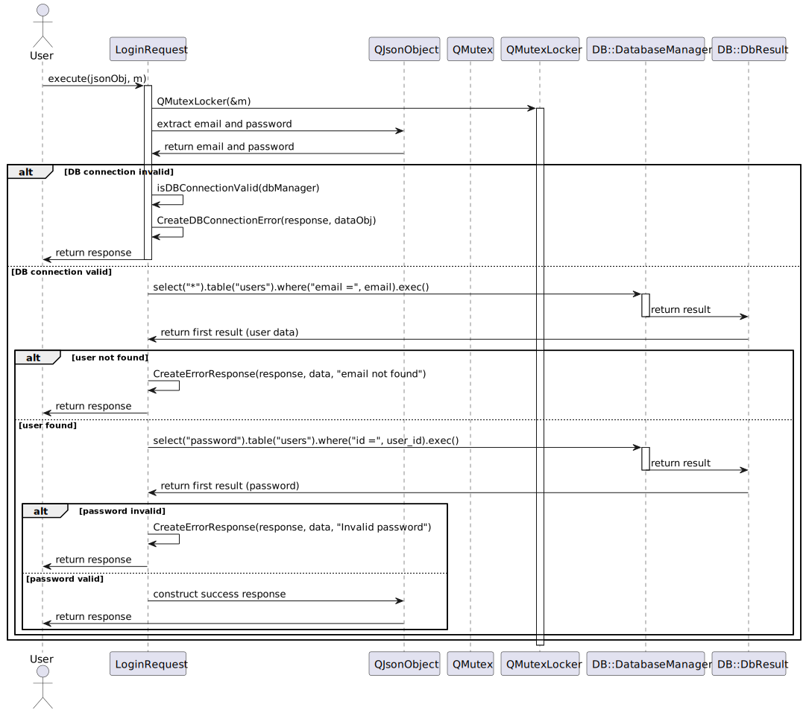
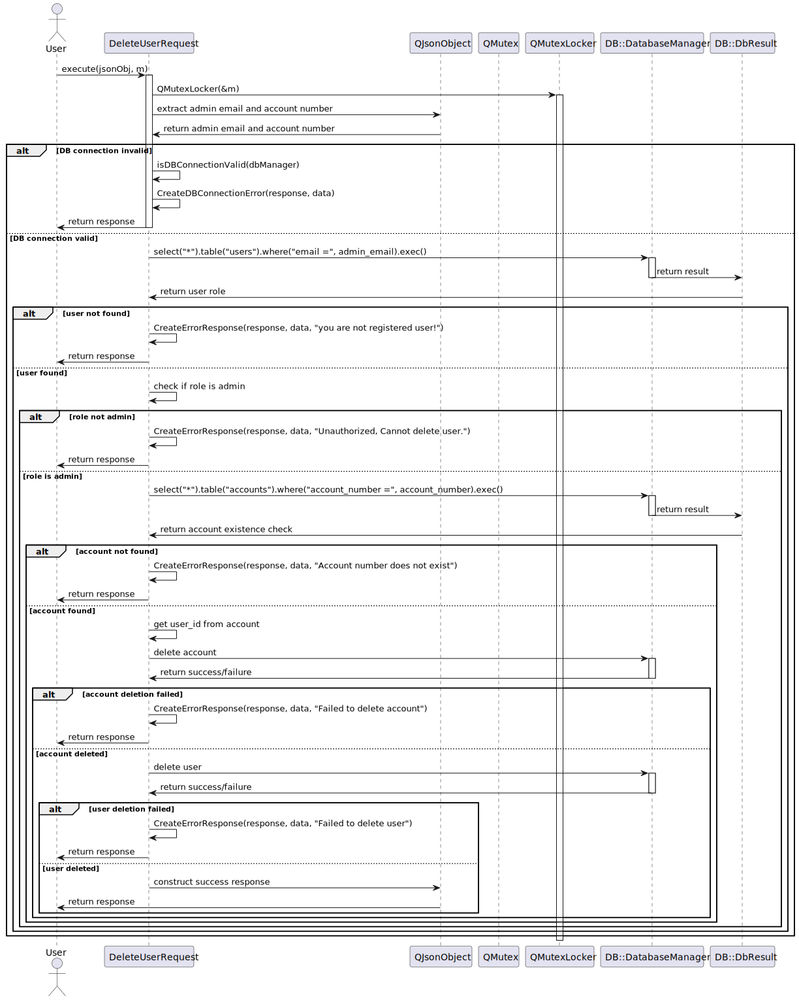

# Sequence Diagrams for Requests

## Sequence diagram : `LoginRequest` processes login request

## Sequence diagram : `CreateNewUserRequest ` processes create new user request

## Sequence diagram : `DeleteUserRequest` processes delete user request

## Sequence diagram : `GetBalanceRequest` processes get balance request

## Sequence diagram : `GetDatabaseRequest` processes get database request

## Sequence diagram : `GetTransactionsHistoryRequest` processes get transactions history request

## Sequence diagram : `MakeTransactionRequest` processes make transaction request

## Sequence diagram : `UpdateEmailRequest` processes update email request

## Sequence diagram : `UpdatePasswordRequest` processes update password request

## Sequence diagram : `UpdateUserRequest` processes update user request

## Sequence diagram : `UserInitRequest` processes user init request

