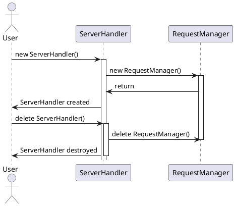
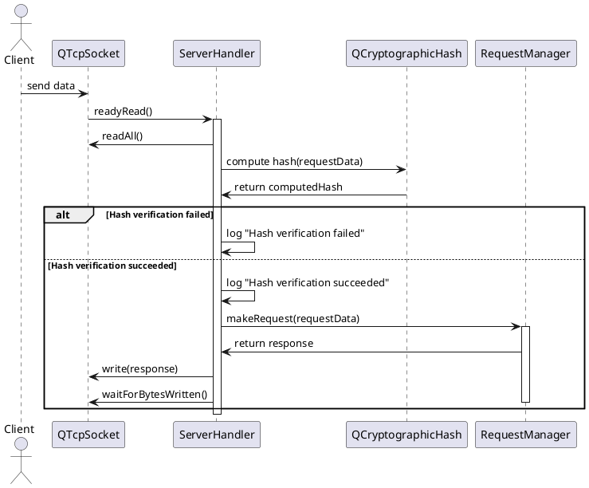
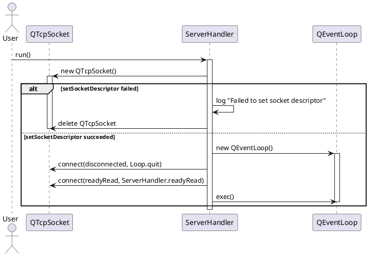
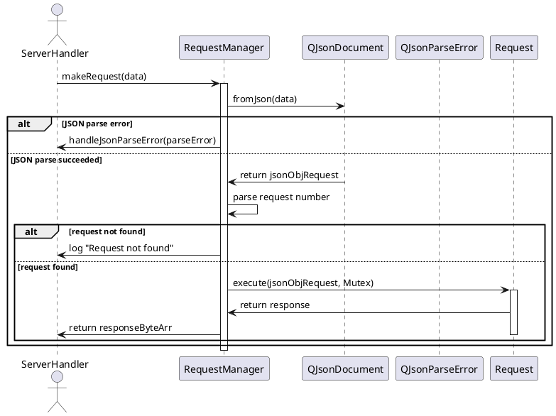
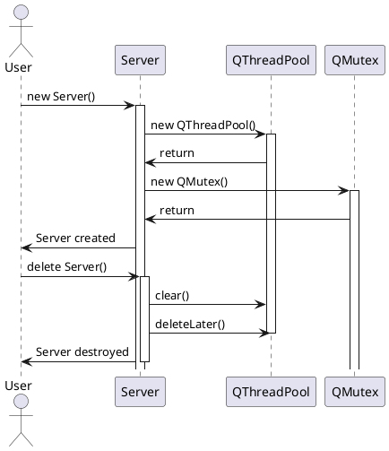
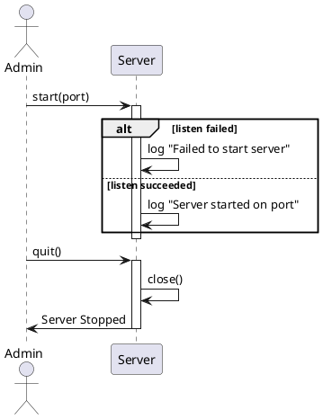
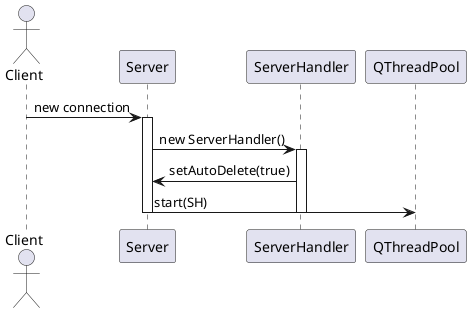
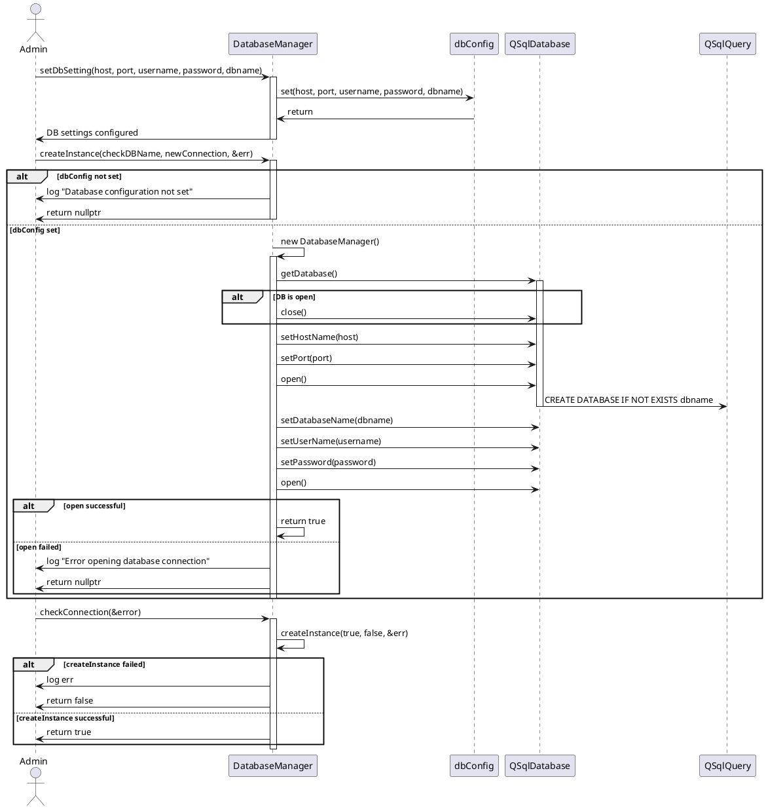
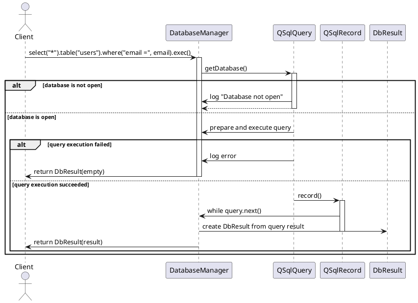

# Sequence Diagrams

## ServerHandler Diagrams:
### Sequence diagram : ServerHandler initialization and destruction



### Sequence diagram : `ServerHandler` processes `readyRead` event


### Sequence diagram : `ServerHandler` runs the `run` method

## RequestManager Diagrams:
### Sequence diagram : `RequestManager` processes requests


## Server Diagrams:
### Sequence diagram : Initialization and destruction of `Server`



### Sequence diagram : `Server` starts and stops



### Sequence diagram : `Server` processes `incomingConnection`



## Request Diagrams:
### Sequence diagram : `Request` processes a request


### Sequence diagram : `Request` base class handles database connection and error response

```plantuml
@startuml
participant "Request" as R
participant "DB::DatabaseManager" as DB
participant "QJsonObject" as JsonObj
participant "QJsonDocument" as JsonDoc

R -> DB: checkConnection()
alt DB connection is null
    R -> R: log "Failed to create instance"
    return false
else DB connection failed
    R -> DB: checkConnection()
    return false with dbError
else DB connection successful
    return true
end

R -> JsonObj: CreateDBConnectionError(response, dataObj)
activate JsonObj
JsonObj -> JsonDoc: construct JSON response
JsonDoc -> JsonObj: return response
JsonObj -> R: return response
deactivate JsonObj

R -> JsonObj: CreateErrorResponse(response, dataObj, message)
activate JsonObj
JsonObj -> JsonDoc: construct JSON response
JsonDoc -> JsonObj: return response
JsonObj -> R: return response
deactivate JsonObj
@enduml
```
## DatabaseManager Diagrams:
### Sequence diagram : `DatabaseManager` initialization and connection check



## Sequence diagram : `DatabaseManager` processes queries (Example: select query) and returns results


